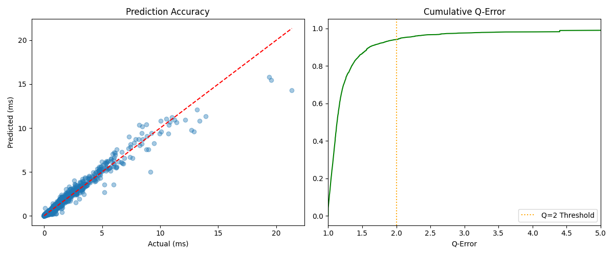
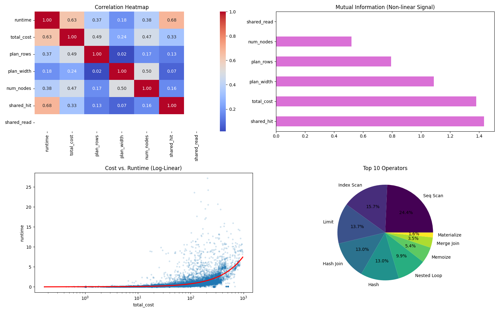

# Hybrid GNN Query Cost Estimator

### The Goal
Traditional database optimizers use static cost models that often fail to capture the non-linear complexities of modern analytical queries. The goal of this project is to build a **Learned Cost Estimator** that treats SQL execution plans as recursive data structures, providing highly accurate, real-world runtime predictions in milliseconds.

### Model Architecture: Hybrid GATv2 with Residual Cost Injection
To move beyond simple regression, I designed a **Hybrid Graph Attention Network (GNN)** that treats the SQL execution plan as a directed acyclic graph (DAG). 

#### 1. Structural Path (GATv2 Layers)
The model utilizes two layers of **GATv2 (Graph Attention Networks)**. Unlike standard GNNs, GATv2 allows nodes to dynamically "attend" to their children.
* **Feature Masking & Encoding:** To prevent "Label Leakage," the optimizer's internal `Total Cost` is stripped from the 27-dimensional node features before entering the GNN. This forces the network to learn the execution complexity based purely on operator types (**21-way One-Hot encoding**) and structural data widths.


#### 2. Attentional Global Pooling
Instead of simple mean pooling, I implemented **Attentional Aggregation**. This uses a trainable "gate" neural network to determine which nodes in the query tree are most significant to the final runtime. This allows the model to prioritize high-impact operators while ignoring trivial leaf nodes like `Limit` or `Result`.

#### 3. Residual "Shortcut" Path
The masked `Total Cost` is re-introduced as a **Residual Shortcut** at the final MLP head. 
* **GNN Path:** Provides a structural "complexity score" derived from the plan's shape.
* **Shortcut Path:** Provides the absolute magnitude of the data being processed.
The final prediction is a fusion of these two paths, allowing the model to refine and correct the optimizer's original cost estimate using learned structural insights.

### 📈 Results at a Glance
After training on 20,000 PostgreSQL plans, the model achieved state-of-the-art accuracy for a local schema:
* **R² Score:** 0.9658
* **Median Q-Error:** 1.13
* **90th Percentile Q:** 1.61

<p align="center">
  
</p>

### Data Generation & Pipeline
* **Query Generation:** A recursive generator produced **20,000 unique queries**, from simple filters to 5-way joins.
* **Ground Truth:** Each query was executed via `EXPLAIN ANALYZE`. To minimize system noise, the **median of 3 runs** was used as the target label.
* **Preprocessing:** Plans were transformed into directed graphs with 27 features per node (Operators, Row Counts, Widths, and Costs).

### Model Health Report

<p align="center">
  
</p>

#### 1. System Requirements
* **Database:** PostgreSQL 12 or higher.
* **Dataset:** The [PostgreSQL Sample DVD Rental Database](https://www.postgresqltutorial.com/postgresql-getting-started/postgresql-sample-database/) must be loaded into your instance.
* **Python:** version 3.8 or higher.

### 2. Python Requirements
All necessary libraries, including **PyTorch Geometric** and **Scikit-Learn**, are listed in the `requirements.txt`. 

To set up your environment:
```bash
pip install -r requirements.txt
```


### Pipeline Execution
The project is orchestrated via `main.py`, supporting end-to-end data collection and training.

#### 1. End-to-End Pipeline
To collect 20,000 queries and train for 300 epochs:

```bash
python main.py --collect --train --size 20000 --epochs 300
```


### Quick Start: Inference & Prediction
The repository includes a pre-trained model (**`query_gnn.pth`**) and the necessary feature scaling parameters (**`scaler.pkl`**). You can test the GNN immediately on the provided execution plans without running the full training pipeline.

#### Running a Prediction
To evaluate one of the provided sample plans, run the following command:

```bash
python predict.py examples/medium_plan.json
```
