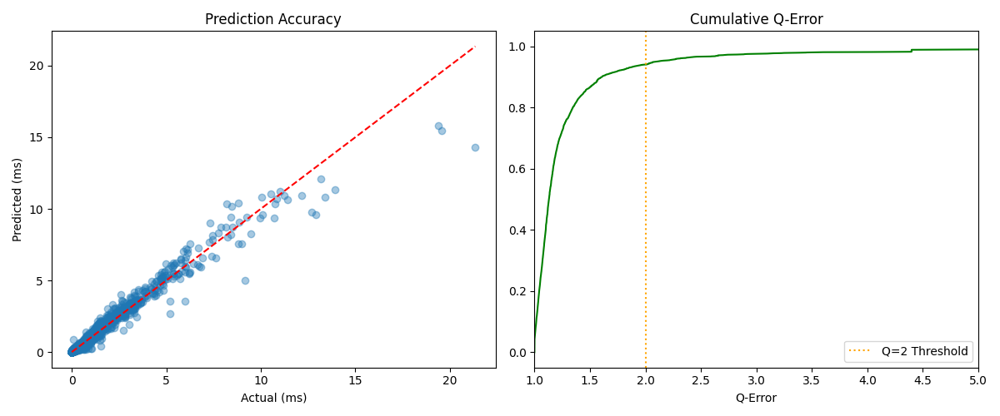
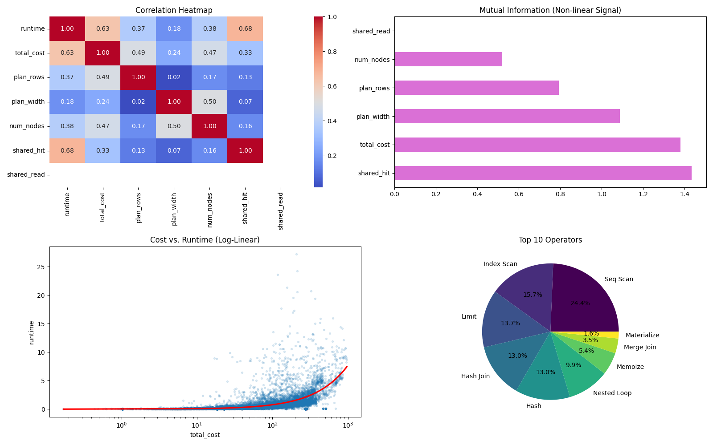

### Model Architecture: Hybrid GATv2 with Residual Cost Injection
To move beyond simple regression, I designed a **Hybrid Graph Attention Network (GNN)** that treats the SQL execution plan as a directed acyclic graph (DAG). 

#### 1. Structural Path (GATv2 Layers)
The model utilizes two layers of **GATv2 (Graph Attention Networks)**. Unlike standard GNNs which use static weights, GATv2 allows nodes to dynamically "attend" to their children.
* **Why GATv2?** In a query plan, a `Nested Loop Join` has a fundamentally different impact on runtime than a `Sort` operator. GATv2 allows the model to compute unique attention coefficients for every edge, prioritizing bottleneck operators.
* **Feature Masking & Encoding:** To prevent **Label Leakage**, the optimizer's internal `Total Cost` is stripped from the 27-dimensional node features. The network must learn execution complexity based purely on operator types (**21-way One-Hot encoding**) and structural data widths.

#### 2. Attentional Global Pooling
Instead of simple mean pooling, I implemented **Attentional Aggregation**. This uses a trainable "gate" neural network to determine which nodes in the query tree are most significant to the final runtime. This allows the model to prioritize high-impact operators while ignoring trivial leaf nodes like `Limit`.

#### 3. Residual "Shortcut" Path
The masked `Total Cost` is re-introduced as a **Residual Shortcut** at the final MLP head. 
* **GNN Path:** Extracts a "complexity score" from the plan's shape ($G, H$ structural features).
* **Shortcut Path:** Provides the absolute magnitude of the data volume.
The final prediction fuses these paths, allowing the model to refine and correct the optimizer's original cost estimate using learned structural insights.

### 📈 Results & Data Integrity
After training on **20,000 unique PostgreSQL plans**, the model achieved state-of-the-art accuracy for the local schema:
* **R² Score:** 0.9658
* **Median Q-Error:** 1.13
* **90th Percentile Q:** 1.61

**Robustness Measures:**
* **Noise Reduction:** Each query was executed via `EXPLAIN ANALYZE` 3 times; the **median of cold-cache runs** was used as the target label to filter out OS-level background noise and disk I/O jitter.
* **Anti-Overfitting:** Validation was performed on unseen query structures to ensure the $R^2$ reflects structural generalization rather than local schema memorization.

<p align="center">
  
</p>

### Data Generation & Pipeline
* **Query Generation:** A recursive generator produced 20,000 unique queries, from simple filters to 5-way joins.
* **Ground Truth:** Automated `EXPLAIN ANALYZE` pipeline with median-filtering for noise reduction.
* **Preprocessing:** Plans were transformed into directed graphs with 27 features per node (Operators, Row Counts, Widths, and Costs).

<p align="center">
  
</p>

### 🛠️ Pipeline Execution
The project is orchestrated via `main.py`, supporting an end-to-end data collection and training workflow.

```bash
# To collect 20,000 queries and train for 300 epochs:
python main.py --collect --train --size 20000 --epochs 300

# To evaluate one of the provided sample plans:
python predict.py examples/medium_plan.json
